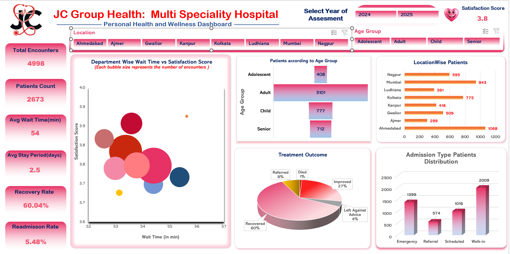
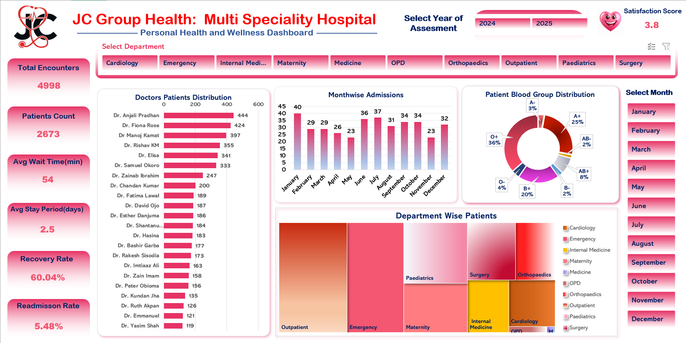
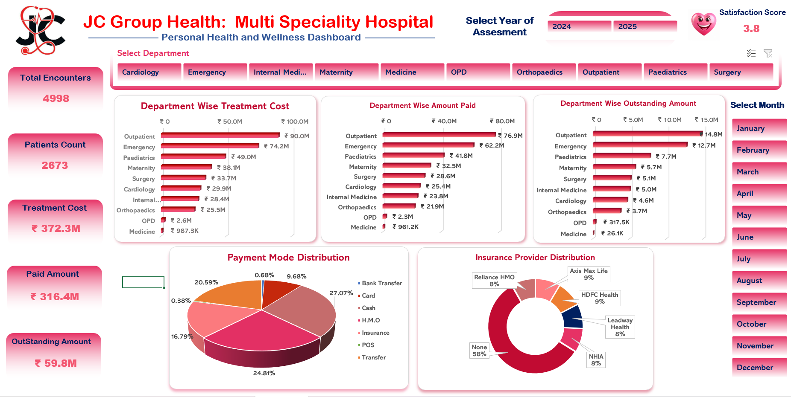

# 🏥 Healthcare Operations & Patient Performance Analysis Dashboard

An interactive Healthcare Analytics Dashboard built entirely in Microsoft Excel to analyze hospital operational performance, patient outcomes, doctor efficiency, and financial metrics.

---
## 📑 Table of Contents
- [📌 Project Overview](#-project-overview)
- [🎯 Objectives](#-objectives)
- [📊 Key Performance Indicators (KPIs)](#-key-performance-indicators-kpis)
- [📈 Dashboard Highlights](#-dashboard-highlights)
- [🔍 Insights Generated](#-insights-generated)
- [🛠 Tools Used](#-tools-used)
- [📂 Dataset](#-dataset)
- [💡 Skills Demonstrated](#-skills-demonstrated)
- [📸 Dashboard Preview](#-dashboard-preview)
- [🚀 Business Value](#-business-value)
- [🔮 Future Scope](#-future-scope)
- [📁 Repository Structure](#-repository-structure)
- [👨‍💻 Author](#-author)

## 📌 Project Overview

This project demonstrates how Excel can be used as a Business Intelligence tool to transform raw healthcare data into meaningful insights.

The dashboard provides hospital administrators with a centralized view of patient statistics, operational KPIs, department performance, revenue generation, and patient satisfaction.

---

## 🎯 Objectives

- Analyze hospital operations
- Monitor patient flow and encounters
- Track department-wise performance
- Measure doctor efficiency
- Evaluate patient satisfaction
- Analyze treatment revenue
- Identify readmission trends
- Support data-driven healthcare decisions

---

## 📊 Key Performance Indicators (KPIs)

- Total Encounters
- Total Patients
- Average Wait Time
- Average Length of Stay
- Average Patient Satisfaction
- Readmission Rate
- Department Revenue
- Payment Distribution

---

## 📈 Dashboard Highlights

### Dashboard 1
- Hospital Overview
- Total Patients
- Total Encounters
- Average Wait Time
- Average Stay Duration
- Satisfaction Score
- Age Group Distribution

---

### Dashboard 2
- Department Performance
- Doctor Performance
- Patient Distribution
- Treatment Cost Analysis
- Revenue by Department

---

### Dashboard 3
- Payment Method Analysis
- Insurance Provider Distribution
- Readmission Analysis
- Financial Performance
- Operational Summary

---

## 🔍 Insights Generated

✔ Department-wise patient load

✔ Average patient waiting time

✔ Patient satisfaction trends

✔ Doctor-wise encounter analysis

✔ Revenue contribution by department

✔ Payment method preferences

✔ Insurance utilization

✔ Readmission statistics

✔ Age group distribution

✔ Treatment cost comparison

---

## 🛠 Tools Used

- Microsoft Excel
- Power Query
- Pivot Tables
- Pivot Charts
- Slicers
- Excel Formulas
- Dashboard Design

---

## 📂 Dataset

The dataset contains healthcare operational records including:

- Patient Information
- Encounter Details
- Departments
- Doctors
- Wait Time
- Length of Stay
- Satisfaction Scores
- Treatment Cost
- Payment Method
- Insurance Provider
- Readmission Status

---

## 💡 Skills Demonstrated

- Data Cleaning
- Data Transformation
- Data Analysis
- Dashboard Development
- Business Intelligence
- Healthcare Analytics
- KPI Design
- Data Visualization

---

## 📸 Dashboard Preview

## Dashboard Preview

### Executive Dashboard



### Operational Dashboard



### Financial Dashboard



## 🚀 Business Value

This dashboard helps healthcare administrators:

- Improve operational efficiency
- Reduce patient waiting time
- Monitor hospital performance
- Track doctor productivity
- Improve patient satisfaction
- Analyze financial performance
- Make data-driven decisions

---
## 🔮 Future Scope

This project can be further enhanced by implementing the following features:

- Integrate real-time patient and hospital management data using SQL databases.
- Develop predictive models to forecast patient admissions and hospital occupancy.
- Implement machine learning algorithms to predict patient readmission risk.
- Create automated email reports and scheduled dashboard refreshes.
- Incorporate patient appointment scheduling and bed occupancy analytics.

## 📁 Repository Structure

```
Healthcare-Operations-Patient-Performance-Analysis/
│
├── Dataset/
│   └── Hospital_Data.xlsx
│
├── images/
│   ├── Dashboard1.png
│   ├── Dashboard2.png
│   └── Dashboard3.png
│
├── Report/
│   ├── Healthcare_Operations_Analysis_Report.pdf
│   └── Healthcare_Operations_Analysis_Report.docx
│
├── Hospital Dashboard.xlsx
│
└── README.md
```

---

## 👨‍💻 Author

**Rishav Kumar Mishra**

Aspiring Data Analyst

### Connect with me

📧 Email: iamkmr1999@gmail.com

🔗 GitHub: https://github.com/iamkmr19

💼 LinkedIn : https://www.linkedin.com/in/kmrishav19/

---

⭐ If you found this project useful, consider giving this repository a Star!
